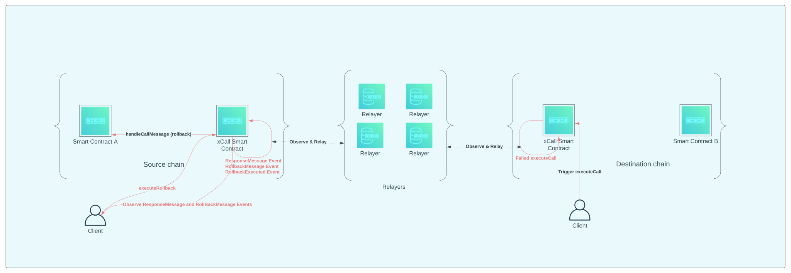

# Error Handling

In successful cases, dApp users only need to invoke two transactions (one for the source chain and the other for the destination chain).
However, there might be some error situations, such as the execution of the call request failing on the destination chain.
In this case, we need to notify the user on the source chain to rollback to the state before the call request.

If a dApp needs to handle a rollback operation, it would fill in some data in the last `_rollback` parameter of the `sendCallMessage` method.
Otherwise, it would have a null value, indicating that no rollback handling is required.

## Simplified Rollback Flow Diagram



Error handling flow:
1. Invocation of [executeCall](SENDING_CROSS_CHAIN_MESSAGE.md#execute-call-on-destination-chain) on the destination chain fails.
2. If the input rollback was non-null, the [ResponseMessage Event](#responsemessage) is relayed back to the source chain,
and the [RollbackMessage](#rollbackmessage) is output by the xCall Smart Contract on the source chain.
3. Once the user recognizes the rollback situation, [executeRollback](#executerollback) is invoked on the source chain's xCall Smart Contract.
4. [executeRollback](#executerollback) invokes the `handleCallMessage` method with the given `_rollback` data on Smart Contract A on the source chain.


Find example implementation of rollback handling [here](https://github.com/R0bi7/xCall-testing-dApp/blob/master/src/services/XCallService.ts#L268).

## ResponseMessage

For all two-way messages (i.e., `_rollback` is non-null), the `xcall` on the source chain receives a response message
from the `xcall` on the destination chain and emits the following event regardless of its success or not.

```java
/**
 * Notifies that a response message has arrived for the `_sn` if the request was a two-way message.
 *
 * @param _sn The serial number of the previous request
 * @param _code The response code
 *              (0: Success, -1: Unknown generic failure, >=1: User defined error code)
 * @param _msg The result message if any
 */
@EventLog(indexed=1)
void ResponseMessage(BigInteger _sn, int _code, String _msg);
```

## RollbackMessage

When an error occurred on the destination chain and the `_rollback` is non-null, `xcall` on the source chain emits the following event
for notifying the user that an additional rollback operation is required.

```java
/**
 * Notifies the user that a rollback operation is required for the request '_sn'.
 *
 * @param _sn The serial number of the previous request
 */
@EventLog(indexed=1)
void RollbackMessage(BigInteger _sn);
```

## executeRollback

The user on the source chain recognizes the rollback situation and invokes the following method on `xcall` with the given `_sn`.
Note that the `executeRollback` can be called only when the original call request has responded with a failure.
It should be reverted when there is no failure response with the call request.

```java
/**
 * Rollbacks the caller state of the request '_sn'.
 *
 * @param _sn The serial number of the previous request
 */
@External
void executeRollback(BigInteger _sn);
```

Then the `xcall` invokes the `handleCallMessage` in the source DApp with the given `_rollback` data.
At this time, the `_from` would be the BTP address of `xcall`.

## RollbackExecuted

As with the `CallExecuted` event above, the following event is emitted after the DApp's `handleCallMessage` execution
to notify its execution result.

```java
/**
 * Notifies that the rollback has been executed.
 *
 * @param _sn The serial number for the rollback
 * @param _code The execution result code
 *              (0: Success, -1: Unknown generic failure, >=1: User defined error code)
 * @param _msg The result message if any
 */
@EventLog(indexed=1)
void RollbackExecuted(BigInteger _sn, int _code, String _msg);
```